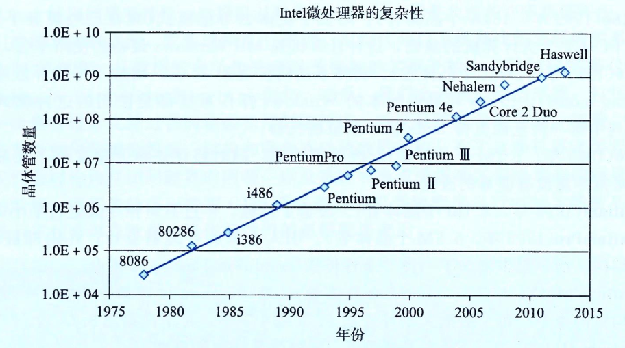

# 3.1 历史观点

Intel 处理器系列俗称 x86，经历了一个长期的、不断进化的发展过程。开始时，它是第一代单芯片、16 位微处理器之一，由于当时集成电路技术水平十分有限，其中做了很多妥协。以后，它不断地成长，利用进步的技术满足更高性能和支持更高级操作系统的需求。

以下列举了一些 Intel 处理器的模型，以及它们的一些关键特性，特别是影响机器级编程的特性。我们用实现这些处理器所需要的晶体管数量来说明演变过程的复杂性。其中，“K” 表示 1000，“M” 表示 1 000 000，而 “G” 表示 1 000 000 000。

* **8086**（1978 年，29 K 个晶体管）。它是第一代单芯片、16 位微处理器之一。8088 是 8086 的一个变种，在 8086 上增加了一个 8 位外部总线，构成最初的 IBM 个人计算机的心脏。IBM 与当时还不强大的微软签订合同，开发 MS-DOS 操作系统。最初的机器型号有 32 768 字节的内存和两个软驱（没有硬盘驱动器）。从体系结构上来说，这些机器只有 655 360 字节的地址空间——地址只有 20 位长（可寻址范围为 1048576 字节），而操作系统保留了 393216 字节自用。1980 年，Intel 提出了 8087 浮点协处理器（45 K 个晶体管），它与一个 8086 或 8088 处理器一同运行，执行浮点指令。8087 建立了 x86 系列的浮点模型，通常被称为 “x87”。
* **80286**（1982 年，134 K 个晶体管）。增加了更多的寻址模式（现在已经废弃了），构成了 IBM PC-AT 个人计算机的基础，这种计算机是 MS Windows 最初的使用平台。
* **i386**（1985 年，275 K 个晶体管）。将体系结构扩展到 32 位。增加了平坦寻址模式（flat addressing model），Linux 和最近版本的 Windows 操作系统都是使用的这种模式。这是 Intel 系列中第一台全面支持 Unix 操作系统的机器。
* **i486**（1989 年，1.2 M 个晶体管）。改善了性能，同时将浮点单元集成到了处理器芯片上，但是指令集没有明显的改变。
* **Pentium**（1993 年，3.1 M 个晶体管）。改善了性能，不过只对指令集进行了小的扩展。
* **Pentium Pro**（1995 年，5.5 M 个晶体管）。引入全新的处理器设计，在内部被称为 F6 微体系结构。指令集中增加了一类“条件传送（conditional move）”指令。
* **Pentium/MMX**（1997 年，4.5 M 个晶体管）。在 Pentium 处理器中增加了一类新的处理整数向量的指令。每个数据大小可以是 1、2 或 4 字节。每个向量总长 64 位。
* **Pentium II**（1997 年，7 M 个晶体管）。P6 微体系结构的延伸。
* **Pentium III**（1999 年，8.2 M 个晶体管）。引入了 SSE，这是一类处理整数或浮点数向量的指令。每个数据可以是 1、2 或 4 个字节，打包成 128 位的向量。由于芯片上包括了二级高速缓存，这种芯片后来的版本最多使用了 24 M 个晶体管。
* **Pentium 4**（2000 年，42 M 个晶体管）。SSE 扩展到了 SSE2，增加了新的数据类型（包括双精度浮点数），以及针对这些格式的 144 条新指令。有了这些扩展，编译器可以使用 SSE 指令（而不是 x87 指令），来编译浮点代码。
* **Pentium 4E**（2004 年，125 M 个晶体管）。增加了**超线程**（hyperthreading），这种技术可以在一个处理器上同时运行两个程序；还增加了 EM64T，它是 Intel 对 AMD 提出的对 IA32 的 64 位扩展的实现，我们称之为 x86-64。
* **Core2**（2006 年，291 M 个晶体管）。回归到类似于 P6 的微体系结构。Intel 的第一个多核微处理器，即多处理器实现在一个芯片上。但不支持超线程。
* **Core i7，NehaIem**（2008 年，781 M 个晶体管）。既支持超线程，也有多核，最初的版本支持每个核上执行两个程序，每个芯片上最多四个核。
* **Core i7，Sandy Bridge**（2011 年，1.17 G 个晶体管）。引入了 AVX，这是对 SSE 的扩展，支持把数据封装进 256 位的向量。
* **Core i7，Haswell**（2013 年，1.4 G 个晶体管）。将 AVX 扩展至 AVX2，增加了更多的指令和指令格式。

每个后继处理器的设计都是后向兼容的一较早版本上编译的代码可以在较新的处理器上运行。正如我们看到的那样，为了保持这种进化传统，指令集中有许多非常奇怪的东西。Intel 处理器系列有好几个名字，包括 IA32，也就是 “Intel 32 位体系结构（Intel Architecture 32-bit）“，以及最新的 Intel64，即 IA32 的 64 位扩展，我们也称为 x86-64。最常用的名字是 “x86”，我们用它指代整个系列，也反映了直到 i486 处理器命名的惯例。


### 旁注 - 摩尔定律（Moore's Law）

如果我们画出各种不同的 Intel 处理器中晶体管的数量与它们出现的年份之间的图（y 轴为晶体管数量的对数值），我们能够看出，增长是很显著的。画一条拟合这些数据的线，可以看到晶体管数量以每年大约 37% 的速率增加，也就是说，晶体管数量每 26 个月就会翻一番。在 x86 微处理器的历史上，这种增长已经持续了好几十年。

1965 年，Gordon Moore，Intel 公司的创始人，根据当时的芯片技术（那时他们能够在一个芯片上制造有大约 64 个晶体管的电路）做出推断，预测在未来 10 年，芯片上的晶体管数量每年都会翻一番。这个预测就称为摩尔定律。正如事实证明的那样，他的预测有点乐观，而且短视。在超过 50 年中，半导体工业一直能够使得晶体管数目每 18 个月翻一倍。

对计算机技术的其他方面，也有类似的呈指数增长的情况出现，比如磁盘和半导体存储器的存储容量。这些惊人的增长速度一直是计算机革命的主要驱动力。


这些年来，许多公司生产出了与 Intel 处理器兼容的处理器，能够运行完全相同的机器级程序。其中，领头的是 AMD。数年来，AMD 在技术上紧跟 Intel，执行的市场策略是：生产性能稍低但是价格更便宜的处理器。2002 年，AMD 的处理器变得更加有竞争力，它们率先突破了可商用微处理器的 1GHz 的时钟速度屏障，并且引入了广泛釆用的 IA32 的 64 位扩展 x86-64。虽然我们讲的是 Intel 处理器，但是对于其竞争对手生产的与之兼容的处理器来说，这些表述也同样成立。

对于由 GCC 编译器产生的、在 Linux 操作系统平台上运行的程序，感兴趣的人大多并不关心 x86 的复杂性。最初的 8086 提供的内存模型和它在 80286 中的扩展，到 i386 的时候就都已经过时了。原来的 x87 浮点指令到引入 SSE2 以后就过时了。虽然在 x86-64 程序中，我们能看到历史发展的痕迹，但 x86 中许多最晦涩难懂的特性已经不会出现了。

