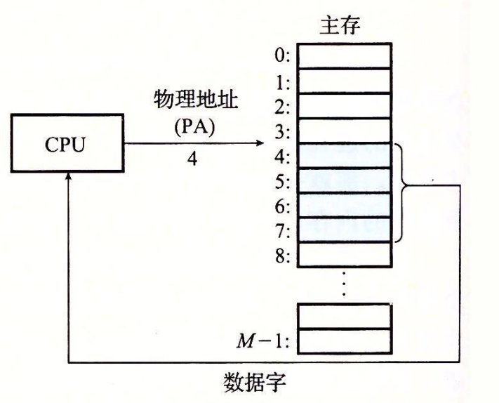
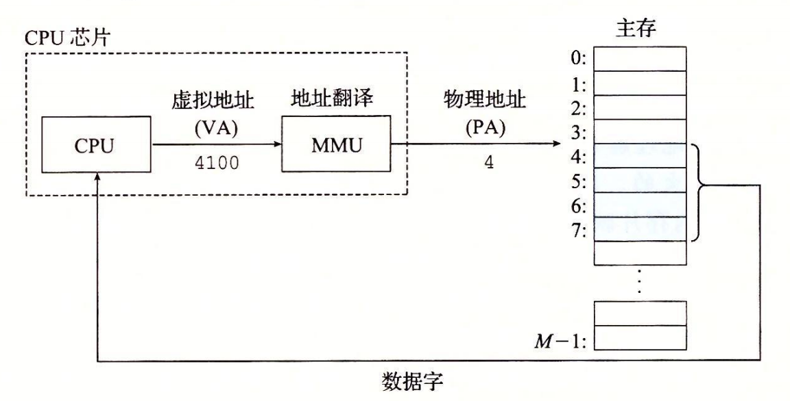

# 9.1 物理和虚拟寻址

计算机系统的主存被组织成一个由 M 个连续的字节大小的单元组成的数组。每字节都有一个唯一的**物理地址**（Physical Address，PA）。第一个字节的地址为 0，接下来的字节地址为 1，再下一个为 2，依此类推。给定这种简单的结构，CPU 访问内存的最自然的方式就是使用物理地址。我们把这种方式称为**物理寻址**（physical addressing）。图 9-1 展示了一个物理寻址的示例，该示例的上下文是一条加载指令，它读取从物理地址 4 处开始的 4 字节字。当 CPU 执行这条加载指令时，会生成一个有效物理地址，通过内存总线，把它传递给主存。主存取岀从物理地址 4 处开始的 4 字节字，并将它返回给 CPU，CPU 会将它存放在一个寄存器里。

早期的 PC 使用物理寻址，而且诸如数字信号处理器、嵌入式微控制器以及 Cray 超级计算机这样的系统仍然继续使用这种寻址方式。然而，现代处理器使用的是一种称为**虚拟寻址**（virtual addressing）的寻址形式，参见图 9-2。

使用虚拟寻址，CPU 通过生成一个**虚拟地址**（Virtual Address，VA）来访问主存，这个虚拟地址在被送到内存之前先转换成适当的物理地址。将一个虚拟地址转换为物理地址的任务叫做**地址翻译**（address translation）。就像异常处理一样，地址翻译需要 CPU 硬件和操作系统之间的紧密合作。CPU 芯片上叫做**内存管理单元**（Memory Management Unit，MMU）的专用硬件，利用存放在主存中的查询表来动态翻译虚拟地址，该表的内容由操作系统管理。

