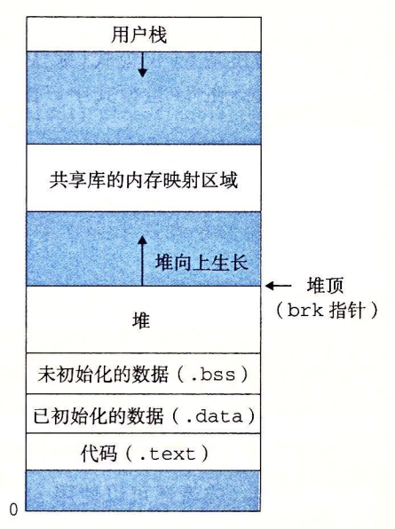
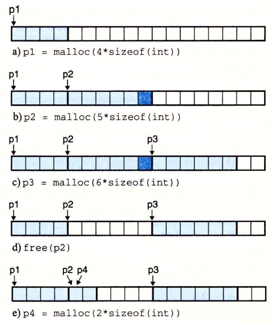
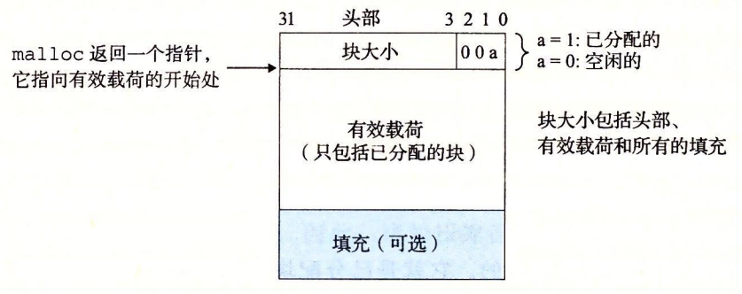
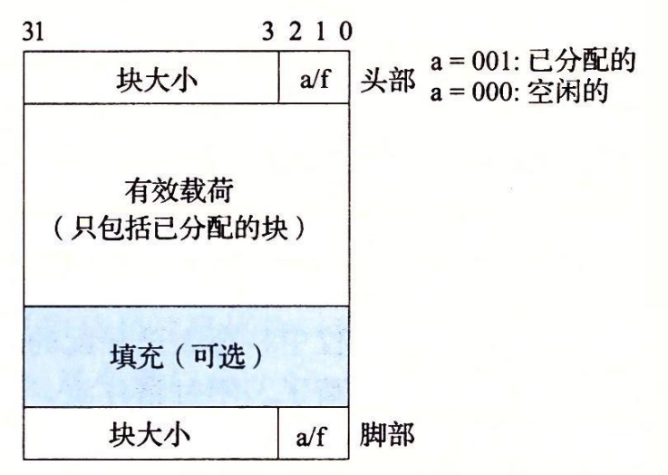
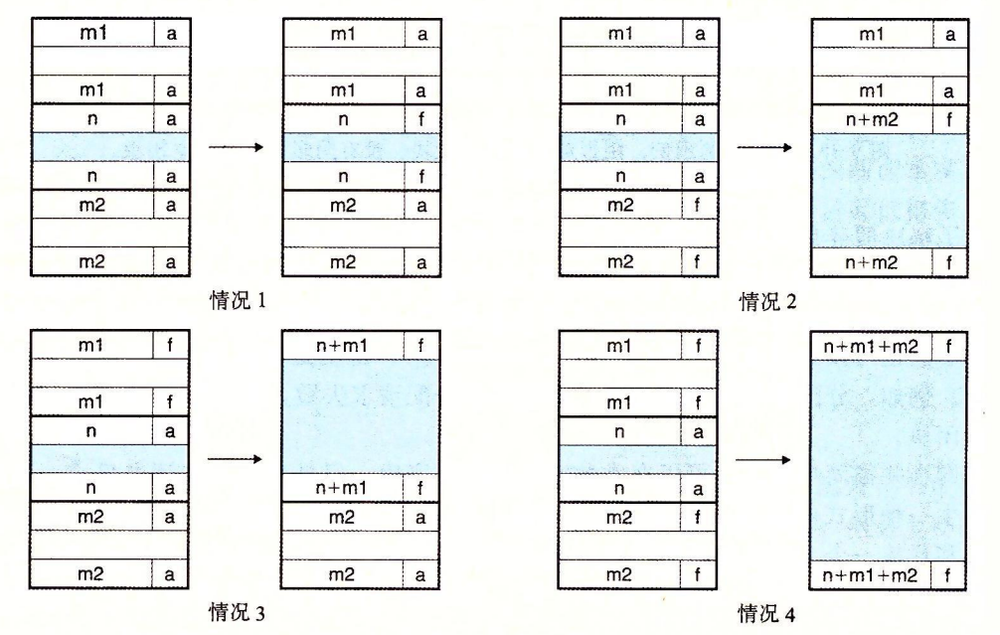
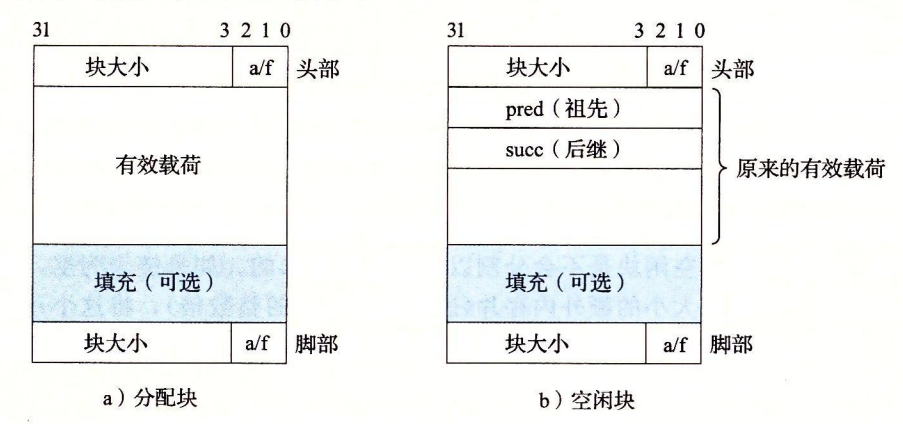

# 9.9 动态内存分配

虽然可以使用低级的 mmap 和 munmap 函数来创建和删除虚拟内存的区域，但是 C 程序员还是会觉得当运行时需要额外虚拟内存时，用**动态内存分配器**（dynamic memory allocator）更方便，也有更好的可移植性。

动态内存分配器维护着一个进程的虚拟内存区域，称为**堆**（heap）（见图 9-33）。系统之间细节不同，但是不失通用性，假设堆是一个请求二进制零的区域，它紧接在未初始化的数据区域后开始，并向上生长（向更高的地址）。对于每个进程，内核维护着一个变量 brk（读做 “break”），它指向堆的顶部。



分配器将堆视为一组不同大小的**块**（block）的集合来维护。每个块就是一个连续的虚拟内存片（chunk），要么是**已分配的**，要么是**空闲的**。已分配的块显式地保留为供应用程序使用。空闲块可用来分配。空闲块保持空闲，直到它显式地被应用所分配。一个已分配的块保持已分配状态，直到它被释放，这种释放要么是应用程序显式执行的，要么是内存分配器自身隐式执行的。

分配器有两种基本风格。两种风格都要求应用显式地分配块。它们的不同之处在于由哪个实体来负责释放已分配的块。

* **显式分配器**（explicit allocator），要求应用显式地释放任何已分配的块。例如，C 标准库提供一种叫做 malloc 程序包的显式分配器。C 程序通过调用 malloc 函数来. 分配一个块，并通过调用 free 函数来释放一个块。C++ 中的 new 和 delete 操作符与 C 中的 malloc 和 free 相当。
* **隐式分配器**（implicit allocator），另一方面，要求分配器检测一个已分配块何时不再被程序所使用，那么就释放这个块。隐式分配器也叫做**垃圾收集器**（garbage collector），而自动释放未使用的已分配的块的过程叫做**垃圾收集**（garbage collection）。例如，诸如 Lisp、ML 以及 Java 之类的高级语言就依赖垃圾收集来释放已分配的块。

本节剩下的部分讨论的是显式分配器的设计和实现。我们将在 9.10 节中讨论隐式分配器。为了更具体，我们的讨论集中于管理堆内存的分配器。然而，应该明白内存分配是一个普遍的概念，可以出现在各种上下文中。例如，图形处理密集的应用程序就经常使用标准分配器来要求获得一大块虚拟内存，然后使用与应用相关的分配器来管理内存，在该块中创建和销毁图形的节点。

## 9.9.1 malloc 和 free 函数

C 标准库提供了一个称为 malloc 程序包的显式分配器。程序通过调用 malloc 函数来从堆中分配块。

```c
#include <stdlib.h>

void *malloc(size_t size);

// 返回：若成功则为已分配块的指针，若出错则为 NULL。
```

malloc 函数返回一个指针，指向大小为至少 size 字节的内存块，这个块会为可能包含在这个块内的任何数据对象类型做对齐。实际中，对齐依赖于编译代码在 32 位模式（**gcc -m32**）还是 64 位模式（默认的）中运行。在 32 位模式中，malloc 返回的块的地址总是 8 的倍数。在 64 位模式中，该地址总是 16 的倍数。


### 旁注 - 一个字有多大

回想一下在第 3 章中我们对机器代码的讨论，Intel 将 4 字节对象称为双字。然而，在本节中，我们会假设字是 4 字节的对象，而双字是 8 字节的对象，这和传统术语是一致的。


如果 malloc 遇到问题（例如，程序要求的内存块比可用的虚拟内存还要大），那么它就返回 NULL，并设置 errno。malloc 不初始化它返回的内存。那些想要已初始化的动态内存的应用程序可以使用 calloc，calloc 是一个基于 malloc 的瘦包装函数，它将分配的内存初始化为零。想要改变一个以前已分配块的大小，可以使用 realloc 函数。

动态内存分配器，例如 malloc，可以通过使用 mmap 和 munmap 函数，显式地分配和释放堆内存，或者还可以使用 sbrk 函数：

```c
#include <unistd.h>

void *sbrk(intptr_t incr);

// 返回：若成功则为旧的 brk 指针，若出错则为 -1。
```

sbrk 函数通过将内核的 brk 指针增加 incr 来扩展和收缩堆。如果成功，它就返回 brk 的旧值，否则，它就返回 -1，并将 errno 设置为 ENOMEM。如果 incr 为零，那么 sbrk 就返回 brk 的当前值。用一个为负的 incr 来调用 sbrk 是合法的，而且很巧妙，因为返回值（brk 的旧值）指向距新堆顶向上 **abs\(incr\)** 字节处。

程序是通过调用 free 函数来释放已分配的堆块。

```c
#include <stdlib.h>

void free(void *ptr);

// 返回：无。
```

ptr 参数必须指向一个从 malloc、calloc 或者 realloc 获得的已分配块的起始位置。如果不是，那么 free 的行为就是未定义的。更糟的是，既然它什么都不返回，free 就不会告诉应用出现了错误。就像我们将在 9.11 节里看到的，这会产生一些令人迷惑的运行时错误。

图 9-34 展示了一个 malloc 和 free 的实现是如何管理一个 C 程序的 16 字的（非常）小的堆的。每个方框代表了一个 4 字节的字。粗线标出的矩形对应于已分配块（有阴影的）和空闲块（无阴影的）。初始时，堆是由一个大小为 16 个字的、双字对齐的、空闲块组成的。（本节中，我们假设分配器返回的块是 8 字节双字边界对齐的。）

* **图 9-34a：**程序请求一个 4 字的块。malloc 的响应是：从空闲块的前部切出一个 4 字的块，并返回一个指向这个块的第一字的指针。
* **图 9-34b：**程序请求一个 5 字的块。malloc 的响应是：从空闲块的前部分配一个 6 字的块。在本例中，malloc 在块里填充了一个额外的字，是为了保持空闲块是双字边界对齐的。
* **图 9-34c：**程序请求一个 6 字的块，而 malloc 就从空闲块的前部切出一个 6 字的块。
* **图 9-34d：**程序释放在图 9-34b 中分配的那个 6 字的块。注意，在调用 free 返回之后，指针 p2 仍然指向被释放了的块。应用有责任在它被一个新的 malloc 调用重新初始化之前，不再使用 p2。
* **图 9-34e：**程序请求一个 2 字的块。在这种情况中，malloc 分配在前一步中被释放了的块的一部分，并返回一个指向这个新块的指针。



> 图 9-34 用 malloc 和 free 分配和释放块。每个方框对应于一个字。每个粗线标出的矩形对应于一个块。阴影部分是已分配的块。已分配的块的填充区域是深阴影的。无阴影部分是空闲块。堆地址是从左往右增加的

## 9.9.2 为什么要使用动态内存分配

程序使用动态内存分配的最重要的原因是经常直到程序实际运行时，才知道某些数据结构的大小。例如，假设要求我们编写一个 C 程序，它读一个 n 个 ASCII 码整数的链表，每一行一个整数，从 stdin 到一个 C 数组。输入是由整数 n 和接下来要读和存储到数组中的 n 个整数组成的。最简单的方法就是静态地定义这个数组，它的最大数组大小是硬编码的：

```c
#include "csapp.h"
#define MAXN 15213

int array[MAXN];

int main()
{
    int i, n;
    
    scanf("%d", &n);
    if (n > MAXN)
        app_error("Input file too big");
    for (i = 0; i < n; i++)
        scanf("%d", &array[i]);
    exit(0);
}
```

像这样用硬编码的大小来分配数组通常不是一种好想法。MAXN 的值是任意的，与机器上可用的虚拟内存的实际数量没有关系。而且，如果这个程序的使用者想读取一个比 MAXN 大的文件，唯一的办法就是用一个更大的 MAXN 值来重新编译这个程序。虽然对于这个简单的示例来说这不成问题，但是硬编码数组界限的出现对于拥有百万行代码和大量使用者的大型软件产品而言，会变成一场维护的噩梦。

一种更好的方法是在运行时，在已知了 n 的值之后，动态地分配这个数组。使用这种方法，数组大小的最大值就只由可用的虚拟内存数量来限制了。

```c
#include "csapp.h"

int main()
{
    int *array, i, n;
    
    scanf("%d", &n);
    array = (int *)Malloc(n * sizeof(int));
    for (i = 0; i < n; i++)
        scanf("%d", &array[i]);
    free(array);
    exit(0);
}
```

动态内存分配是一种有用而重要的编程技术。然而，为了正确而高效地使用分配器，程序员需要对它们是如何工作的有所了解。我们将在 9.11 节中讨论因为不正确地使用分配器所导致的一些可怕的错误。

## 9.9.3 分配器的要求和目标

显式分配器必须在一些相当严格的约束条件下工作：

* **处理任意请求序列。**一个应用可以有任意的分配请求和释放请求序列，只要满足约束条件：每个释放请求必须对应于一个当前已分配块，这个块是由一个以前的分配请求获得的。因此，分配器不可以假设分配和释放请求的顺序。例如，分配器不能假设所有的分配请求都有相匹配的释放请求，或者有相匹配的分配和空闲请求是嵌套的。
* **立即响应请求。**分配器必须立即响应分配请求。因此，不允许分配器为了提高性能重新排列或者缓冲请求。
* **只使用堆。**为了使分配器是可扩展的，分配器使用的任何非标量数据结构都必须保存在堆里。
* **对齐块（对齐要求）。**分配器必须对齐块，使得它们可以保存任何类型的数据对象。
* **不修改已分配的块。**分配器只能操作或者改变空闲块。特别是，一旦块被分配了，就不允许修改或者移动它了。因此，诸如压缩已分配块这样的技术是不允许使用的。

在这些限制条件下，分配器的编写者试图实现吞吐率最大化和内存使用率最大化，而这两个性能目标通常是相互冲突的。

**目标 1：最大化呑吐率。**假定 n 个分配和释放请求的某种序列：

$$
R_0,R_1,\cdots,R_k,\cdots,R_{n-1}
$$

我们希望一个分配器的吞吐率最大化，吞吐率定义为每个单位时间里完成的请求数。例如，如果一个分配器在 1 秒内完成 500 个分配请求和 500 个释放请求，那么它的吞吐率就是每秒 1000 次操作。一般而言，我们可以通过使满足分配和释放请求的平均时间最小化来使吞吐率最大化。正如我们会看到的，开发一个具有合理性能的分配器并不困难，所谓合理性能是指一个分配请求的最糟运行时间与空闲块的数量成线性关系，而一个释放请求的运行时间是个常数。

**目标 2：最大化内存利用率。**天真的程序员经常不正确地假设虚拟内存是一个无限的资源。实际上，一个系统中被所有进程分配的虚拟内存的全部数量是受磁盘上交换空间的数量限制的。好的程序员知道虚拟内存是一个有限的空间，必须高效地使用。对于可能被要求分配和释放大块内存的动态内存分配器来说，尤其如此。

有很多方式来描述一个分配器使用堆的效率如何。在我们的经验中，最有用的标准是**峰值利用率**（peak utilization）。像以前一样，我们给定 n 个分配和释放请求的某种顺序

$$
R_0,R_1,\cdots,R_k,\cdots,R_{n-1}
$$

如果一个应用程序请求一个 p字节的块，那么得到的已分配块的**有效载荷**（payload）是 p 字节。在请求$$R_k$$完成之后，**聚集有效载荷**（aggregate payload）表示为$$P_k$$，为当前已分配的块的有效载荷之和，而$$H_k$$表示堆的当前的（单调非递减的）大小。

那么，前如$$\small k+1$$个请求的峰值利用率，表示为$$\small U_k$$可以通过下式得到：

$$
U_k = \frac{max_{i\leqslant k}P_i}{H_k}
$$

那么，分配器的目标就是在整个序列中使峰值利用率 $$U_{n-1}$$ 最大化。正如我们将要看到的，在最大化吞吐率和最大化利用率之间是互相牵制的。特别是，以堆利用率为代价，很容易编写出吞吐率最大化的分配器。分配器设计中一个有趣的挑战就是在两个目标之间找到一个适当的平衡。


### 旁注 - 放宽单调性假设

我们可以通过让成为前$$\small k+1$$个请求的最高峰，从而使得在我们对$$U_k$$的定义中放宽单调非递减的假设，并且允许堆增长和降低。


## 9.9.4 碎片

造成堆利用率很低的主要原因是一种称为**碎片**（fragmentation）的现象，当虽然有未使用的内存但不能用来满足分配请求时，就发生这种现象。有两种形式的碎片：内部碎片（internal fragmentation）和外部碎片（external fragmentation）。

**内部碎片**是在一个已分配块比有效载荷大时发生的。很多原因都可能造成这个问题。例如，一个分配器的实现可能对已分配块强加一个最小的大小值，而这个大小要比某个请求的有效载荷大。或者，就如我们在图 9-34b 中看到的，分配器可能增加块大小以满足对齐约束条件。

内部碎片的量化是简单明了的。它就是已分配块大小和它们的有效载荷大小之差的和。因此，在任意时刻，内部碎片的数量只取决于以前请求的模式和分配器的实现方式。

**外部碎片**是当空闲内存合计起来足够满足一个分配请求，但是没有一个单独的空闲块足够大可以来处理这个请求时发生的。例如，如果图 9-34e 中的请求要求 6 个字，而不是 2 个字，那么如果不向内核请求额外的虚拟内存就无法满足这个请求，即使在堆中仍然有 6 个空闲的字。问题的产生是由于这 6 个字是分在两个空闲块中的。

外部碎片比内部碎片的量化要困难得多，因为它不仅取决于以前请求的模式和分配器的实现方式，还取决于将来请求的模式。例如，假设在 k 个请求之后，所有空闲块的大小都恰好是 4 个字。这个堆会有外部碎片吗？答案取决于将来请求的模式。如果将来所有的分配请求都要求小于或者等于 4 个字的块，那么就不会有外部碎片。另一方面，如果有一个或者多个请求要求比 4 个字大的块，那么这个堆就会有外部碎片。

因为外部碎片难以量化且不可能预测，所以分配器通常釆用启发式策略来试图维持少量的大空闲块，而不是维持大量的小空闲块。

## 9.9.5 实现问题

可以想象出的最简单的分配器会把堆组织成一个大的字节数组，还有一个指针 p，初始指向这个数组的第一个字节。为了分配 size 个字节，malloc 将 p 的当前值保存在栈里，将 p 增加 size，并将 p 的旧值返回到调用函数。free 只是简单地返回到调用函数，而不做其他任何事情。

这个简单的分配器是设计中的一种极端情况。因为每个 malloc 和 free 只执行很少量的指令，吞吐率会极好。然而，因为分配器从不重复使用任何块，内存利用率将极差。一个实际的分配器要在吞吐率和利用率之间把握好平衡，就必须考虑以下几个问题：

* **空闲块组织：**我们如何记录空闲块？
* **放置：**我们如何选择一个合适的空闲块来放置一个新分配的块？
* **分割：**在将一个新分配的块放置到某个空闲块之后，我们如何处理这个空闲块中的剩余部分？
* **合并：**我们如何处理一个刚刚被释放的块？

本节剩下的部分将更详细地讨论这些问题。因为像放置、分割以及合并这样的基本技术贯穿在许多不同的空闲块组织中，所以我们将在一种叫做隐式空闲链表的简单空闲块组织结构中来介绍它们。

## 9.9.6 隐式空闲链表

任何实际的分配器都需要一些数据结构，允许它来区别块边界，以及区别已分配块和空闲块。大多数分配器将这些信息嵌入块本身。一个简单的方法如图 9-35 所示。



在这种情况中，一个块是由一个字的头部、有效载荷，以及可能的一些额外的填充组成的。头部编码了这个块的大小（包括头部和所有的填充），以及这个块是已分配的还是空闲的。如果我们强加一个双字的对齐约束条件，那么块大小就总是 8 的倍数，且块大小的最低 3 位总是零。因此，我们只需要内存大小的 29 个高位，释放剩余的 3 位来编码其他信息。在这种情况中，我们用其中的最低位（已分配位）来指明这个块是已分配的还是空闲的。例如，假设我们有一个已分配的块，大小为 24（0x18）字节。那么它的头部将是

**0x00000018 \| 0x1 = 0x00000019**

类似地，一个块大小为 40（0x28）字节的空闲块有如下的头部：

**0x00000028 \| 0x0 = 0x00000028**

头部后面就是应用调用 malloc 时请求的有效载荷。有效载荷后面是一片不使用的填充块，其大小可以是任意的。需要填充有很多原因。比如，填充可能是分配器策略的一部分，用来对付外部碎片。或者也需要用它来满足对齐要求。

假设块的格式如图 9-35 所示，我们可以将堆组织为一个连续的已分配块和空闲块的序列，如图 9-36 所示。


> 图 9-36 用隐式空闲链表来组织堆。阴影部分是已分配块。没有阴影的部分是空闲块。头部标记为（大小（字节）/ 已分配位）

我们称这种结构为**隐式空闲链表**，是因为空闲块是通过头部中的大小字段隐含地连接着的。分配器可以通过遍历堆中所有的块，从而间接地遍历整个空闲块的集合。注意，我们需要某种特殊标记的结束块，在这个示例中，就是一个设置了已分配位而大小为零的终止头部（terminating header）。（就像我们将在 9.9.12 节中看到的，设置已分配位简化了空闲块的合并。）

隐式空闲链表的优点是简单。显著的缺点是任何操作的开销，例如放置分配的块，要求对空闲链表进行搜索，该搜索所需时间与堆中已分配块和空闲块的总数呈线性关系。

很重要的一点就是意识到系统对齐要求和分配器对块格式的选择会对分配器上的最小块大小有强制的要求。没有已分配块或者空闲块可以比这个最小值还小。例如，如果我们假设一个双字的对齐要求，那么每个块的大小都必须是双字（8 字节）的倍数。因此，图 9-35 中的块格式就导致最小的块大小为两个字：一个字作头，另一个字维持对齐要求。即使应用只请求一字节，分配器也仍然需要创建一个两字的块。

### 练习题 9.6



确定下面 malloc 请求序列产生的块大小和头部值。假设：1）分配器保持双字对齐，并且使用块格式如图 9-35 中所示的隐式空闲链表。2）块大小向上舍入为最接近的 8 字节的倍数。

| 请求 | 块大小（十进制字节） | 块头部（十六进制） |
| :--- | :--- | :--- |
| malloc\(1\) |  |  |
| malloc\(5\) |  |  |
| malloc\(12\) |  |  |
| malloc\(13\) |  |  |





这道题触及了一些核心的概念，例如对齐要求、最小块大小以及头部编码。确定块大小的一般方法是，将所请求的有效载荷和头部大小的和舍入到对齐要求（在此例中是 8 字节）最近的整数倍。比如，**malloc\(1\)** 请求的块大小是 4+1=5，然后舍入到 8。而 **malloc\(13\)** 请求的块大小是 13+4=17，舍入到 24。

| 请求 | 块大小（十进制字节） | 块头部（十六进制） |
| :--- | :---: | :---: |
| malloc\(1\) | 8 | 0x9 |
| malloc\(5\) | 16 | 0x11 |
| malloc\(12\) | 16 | 0x11 |
| malloc\(13\) | 24 | 0x9 |



## 9.9.7 放置已分配的块

当一个应用请求一个互字节的块时，分配器搜索空闲链表，查找一个足够大可以放置所请求块的空闲块。分配器执行这种搜索的方式是由放置策略（placement policy）确定的。一些常见的策略是首次适配（firstfit），下一次适配（nextfit）和最佳适配（bestfit）„

首次适配从头开始搜索空闲链表，选择第一个合适的空闲块。下一次适配和首次适配很相似，只不过不是从链表的起始处开始每次搜索，而是从上一次查询结束的地方开始。最佳适配检查每个空闲块，选择适合所需请求大小的最小空闲块。

首次适配的优点是它趋向于将大的空闲块保留在链表的后面。缺点是它趋向于在靠近链表起始处留下小空闲块的“碎片”，这就增加了对较大块的搜索时间。下一次适配是由 Donald Knuth 作为首次适配的一种代替品最早提出的，源于这样一个想法：如果我们上一次在某个空闲块里已经发现了一个匹配，那么很可能下一次我们也能在这个剩余块中发现匹配。下一次适配比首次适配运行起来明显要快一些，尤其是当链表的前面布满了许多小的碎片时。然而，一些研究表明，下一次适配的内存利用率要比首次适配低得多。研究还表明最佳适配比首次适配和下一次适配的内存利用率都要高一些。然而，在简单空闲链表组织结构中，比如隐式空闲链表中，使用最佳适配的缺点是它要求对堆进行彻底的搜索。在后面，我们将看到更加精细复杂的分离式空闲链表组织，它接近于最佳适配策略，不需要进行彻底的堆搜索。

## 9.9.8 分割空闲块

一旦分配器找到一个匹配的空闲块，它就必须做另一个策略决定，那就是分配这个空闲块中多少空间。一个选择是用整个空闲块。虽然这种方式简单而快捷，但是主要的缺点就是它会造成内部碎片。如果放置策略趋向于产生好的匹配，那么额外的内部碎片也是可以接受的。

然而，如果匹配不太好，那么分配器通常会选择将这个空闲块分割为两部分。第一部分变成分配块，而剩下的变成一个新的空闲块。图 9-37 展示了分配器如何分割图 9-36 中 8 个字的空闲块，来满足一个应用的对堆内存 3 个字的请求。


> 图 9-37 分割一个空闲块，以满足一个 3 个字的分配请求。阴影部分是已分配块。没有阴影的部分是空闲块。头部标记为（大小（字节）/ 已分配位）

## 9.9.9 获取额外的堆内存

如果分配器不能为请求块找到合适的空闲块将发生什么呢？一个选择是通过合并那些在内存中物理上相邻的空闲块来创建一些更大的空闲块（在下一节中描述）。然而，如果这样还是不能生成一个足够大的块，或者如果空闲块已经最大程度地合并了，那么分配器就会通过调用 sbrk 函数，向内核请求额外的堆内存。分配器将额外的内存转化成一个大的空闲块，将这个块插入到空闲链表中，然后将被请求的块放置在这个新的空闲块中。

## 9.9.10 合并空闲块

当分配器释放一个已分配块时，可能有其他空闲块与这个新释放的空闲块相邻。这些邻接的空闲块可能引起一种现象，叫做**假碎片**（fault fragmentation），就是有许多可用的空闲块被切割成为小的、无法使用的空闲块。比如，图 9-38 展示了释放图 9-37 中分配的块后得到的结果。结果是两个相邻的空闲块，每一个的有效载荷都为 3 个字。因此，接下来一个对 4 字有效载荷的请求就会失败，即使两个空闲块的合计大小足够大，可以满足这个请求。


> 图 9-38 假碎片的示例。阴影部分是已分配块。没有阴影的部分是空闲块。头部标记为（大小（字节）/ 已分配位）

为了解决假碎片问题，任何实际的分配器都必须合并相邻的空闲块，这个过程称为**合并**（coalescing）。这就出现了一个重要的策略决定，那就是何时执行合并。分配器可以选择**立即合并**（immediate coalescing），也就是在每次一个块被释放时，就合并所有的相邻块。或者它也可以选择**推迟合并**（deferred coalescing），也就是等到某个稍晚的时候再合并空闲块。例如，分配器可以推迟合并，直到某个分配请求失败，然后扫描整个堆，合并所有的空闲块。

立即合并很简单明了，可以在常数时间内执行完成，但是对于某些请求模式，这种方式会产生一种形式的抖动，块会反复地合并，然后马上分割。例如，在图 9-38 中，反复地分配和释放一个 3 个字的块将产生大量不必要的分割和合并。在对分配器的讨论中，我们会假设使用立即合并，但是你应该了解，快速的分配器通常会选择某种形式的推迟合并。

## 9.9.11 带边界标记的合并

分配器是如何实现合并的？让我们称想要释放的块为当前块。那么，合并（内存中的）下一个空闲块很简单而且高效。当前块的头部指向下一个块的头部，可以检查这个指针以判断下一个块是否是空闲的。如果是，就将它的大小简单地加到当前块头部的大小上，这两个块在常数时间内被合并。

但是我们该如何合并前面的块呢？给定一个带头部的隐式空闲链表，唯一的选择将是搜索整个链表，记住前面块的位置，直到我们到达当前块。使用隐式空闲链表，这意味着每次调用 free 需要的时间都与堆的大小成线性关系。即使使用更复杂精细的空闲链表组织，搜索时间也不会是常数。

Knuth 提出了一种聪明而通用的技术，叫做**边界标记（**boundary tag），允许在常数时间内进行对前面块的合并。这种思想，如图 9-39 所示，是在每个块的结尾处添加一个**脚部**（footer，边界标记），其中脚部就是头部的一个副本。如果每个块包括这样一个脚部，那么分配器就可以通过检査它的脚部，判断前面一个块的起始位置和状态，这个脚部总是在距当前块开始位置一个字的距离。



考虑当分配器释放当前块时所有可能存在的情况：

1. 前面的块和后面的块都是已分配的。
2. 前面的块是已分配的，后面的块是空闲的。
3. 前面的块是空闲的，而后面的块是已分配的。
4. 前面的和后面的块都是空闲的。

图 9-40 展示了我们如何对这四种情况进行合并。



> 图 9-40 使用边界标记的合并
>
> （情况 1：前面的和后面块都已分配。情况 2：前面块已分配，后面块空闲。情况 3：前面块空闲，后面块已分配。情况 4：后面块和前面块都空闲）

* 在情况 1 中，两个邻接的块都是已分配的，因此不可能进行合并。所以当前块的状态只是简单地从已分配变成空闲。
* 在情况 2 中，当前块与后面的块合并。用当前块和后面块的大小的和来更新当前块的头部和后面块的脚部。
* 在情况 3 中，前面的块和当前块合并。用两个块大小的和来更新前面块的头部和当前块的脚部。
* 在情况 4 中，要合并所有的三个块形成一个单独的空闲块，用三个块大小的和来更新前面块的头部和后面块的脚部。在每种情况中，合并都是在常数时间内完成的。

边界标记的概念是简单优雅的，它对许多不同类型的分配器和空闲链表组织都是通用的。然而，它也存在一个潜在的缺陷。它要求每个块都保持一个头部和一个脚部，在应用程序操作许多个小块时，会产生显著的内存开销。例如，如果一个图形应用通过反复调用 malloc 和 free 来动态地创建和销毁图形节点，并且每个图形节点都只要求两个内存字，那么头部和脚部将占用每个已分配块的一半的空间。

幸运的是，有一种非常聪明的边界标记的优化方法，能够使得在已分配块中不再需要脚部。回想一下，当我们试图在内存中合并当前块以及前面的块和后面的块时，只有在前面的块是空闲时，才会需要用到它的脚部。如果我们把前面块的已分配/空闲位存放在当前块中多出来的低位中，那么已分配的块就不需要脚部了，这样我们就可以将这个多出来的空间用作有效载荷了。不过请注意，空闲块仍然需要脚部。

### 练习题 9.7



确定下面每种对齐要求和块格式的组合的最小的块大小。假设：隐式空闲链表，不允许有效载荷为零，头部和脚部存放在 4 字节的字中。

| 对齐要求 | 已分配的块 | 空闲块 | 最小块大小\(字节\) |
| :---: | :--- | :--- | :---: |
| 单字 | 头部和脚部 | 头部和脚部 |  |
| 单字 | 头部，但是无脚部 | 头部和脚部 |  |
| 双字 | 头部和脚部 | 头部和脚部 |  |
| 双字 | 头部，但是没有脚部 | 头部和脚部 |  |





最小块大小对内部碎片有显著的影响。因此，理解和不同分配器设计和对齐要求相关联的最小块大小是很好的。很有技巧的一部分是，要意识到相同的块可以在不同时刻被分配或者被释放。因此，最小块大小就是最小已分配块大小和最小空闲块大小两者的最大值。例如，在最后一个子问题中，最小的已分配块大小是一个 4 字节头部和一个 1 字节有效载荷，舍入到 8 字节。而最小空闲块的大小是一 个 4 字节的头部和一个 4 字节的脚部，加起来是 8 字节，已经是 8 的倍数，就不需要再舍入了。所以，这个分配器的最小块大小就是 8 字节。

| 对齐要求 | 已分配的块 | 空闲块 | 最小块大小\(字节\) |
| :---: | :--- | :--- | :---: |
| 单字 | 头部和脚部 | 头部和脚部 | 12 |
| 单字 | 头部，但是无脚部 | 头部和脚部 | 8 |
| 双字 | 头部和脚部 | 头部和脚部 | 16 |
| 双字 | 头部，但是没有脚部 | 头部和脚部 | 8 |



## 9.9.12 综合：实现一个简单的分配器

构造一个分配器是一件富有挑战性的任务。设计空间很大，有多种块格式、空闲链表格式，以及放置、分割和合并策略可供选择。另一个挑战就是你经常被迫在类型系统的安全和熟悉的限定之外编程，依赖于容易出错的指针强制类型转换和指针运算，这些操作都属于典型的低层系统编程。

虽然分配器不需要大量的代码，但是它们也还是细微而不可忽视的。熟悉诸如 C++ 或者 Java 之类高级语言的学生通常在他们第一次遇到这种类型的编程时，会遭遇一个概念上的障碍。为了帮助你清除这个障碍，我们将基于隐式空闲链表，使用立即边界标记合并方式，从头至尾地讲述一个简单分配器的实现。最大的块大小为$$2^{32}=4$$GB。代码是 64 位干净的，即代码能不加修改地运行在 32 位（**gcc -m32**）或 64 位（**gcc -m64**）的进程中。

### 1. 通用分配器设计

我们的分配器使用如图 9-41 所示的 memlib.c 包所提供的一个内存系统模型。模型的目的在于允许我们在不干涉已存在的系统层 malloc 包的情况下，运行分配器。



```c
/* Private global variables */
static char *mem_heap;     /* Points to first byte of heap */
static char *mem_brk;      /* Points to last byte of heap plus 1 */
static char *mem_max_addr; /* Max legal heap addr plus 1*/

/*
* mem_init - Initialize the memory system model
*/
void mem_init(void)
{
    mem_heap = (char *)Malloc(MAX_HEAP);
    mem_brk = (char *)mem_heap;
    mem_max_addr = (char *)(mem_heap + MAX_HEAP);
}

/*
* mem_sbrk - Simple model of the sbrk function. Extends the heap
*    by incr bytes and returns the start address of the new area. In
*    this model, the heap cannot be shrunk.
*/
void *mem_sbrk(int incr)
{
    char *old_brk = mem_brk;

    if ( (incr < 0) || ((mem_brk + incr) > mem_max_addr)) {
        errno = ENOMEM;
        fprintf(stderr, "ERROR: mem_sbrk failed. Ran out of memory...\n");
        return (void *) - 1;
    }
    mem_brk += incr;
    return (void *)old_brk;
}
```



> 图 9-41 memlib.c：内存系统模型

mem\_init 函数将对于堆来说可用的虚拟内存模型化为一个大的、双字对齐的字节数组。在 mem\_heap 和 mem\_brk 之间的字节表示已分配的虚拟内存。mem\_brk 之后的字节表示未分配的虚拟内存。分配器通过调用 mem\_sbrk 函数来请求额外的堆内存，这个函数和系统的 sbrk 函数的接口相同，而且语义也相同，除了它会拒绝收缩堆的请求。

分配器包含在一个源文件中（mm.c），用户可以编译和链接这个源文件到他们的应用之中。分配器输出三个函数到应用程序：

```c
extern int mm_init(void);
extern void *mm_malloc (size_t size);
extern void mm_free (void *ptr);
```

mm\_init 函数初始化分配器，如果成功就返回 0，否则就返回 -1。mm\_malloc 和 mm\_free 函数 与它们对应的系统函数有相同的接口和语义。分配器使用如图 9-39 所示的块格式。最小块的大小为 16 字节。空闲链表组织成为一个隐式空闲链表，具有如图 9-42 所示的恒定形式。


第一个字是一个双字边界对齐的不使用的填充字。填充后面紧跟着一个特殊的**序言块**（prologue block），这是一个 8 字节的已分配块，只由一个头部和一个脚部组成。序言块是在初始化时创建的，并且永不释放。在序言块后紧跟的是零个或者多个由 malloc 或者 free 调用创建的普通块。堆总是以一个特殊的**结尾块**（epilogue block）来结束，这个块是一个大小为零的已分配块，只由一个头部组成。序言块和结尾块是一种消除合并时边界条件的技巧。分配器使用一个单独的私有（static）全局变量（heap\_listp），它总是指向序言块。（作为一个小优化，我们可以让它指向下一个块，而不是这个序言块。）

### 2. 操作空闲链表的基本常数和宏

图 9-43 展示了一些我们在分配器编码中将要使用的基本常数和宏。第 2 ~ 4 行定义了一些基本的大小常数：字的大小（WSIZE）和双字的大小（DSIZE），初始空闲块的大小和扩展堆时的默认大小（CHUNKSIZE）。



```c
/* Basic constants and macros */
#define WSIZE 4             /* Word and header/footer size (bytes) */
#define DSIZE 8             /* Double word size (bytes) */
#define CHUNKSIZE (1<<12)   /* Extend heap by this amount (bytes) */

#define MAX(x, y) ((x) > (y)? (x) : (y))

/* Pack a size and allocated bit into a word */
#define PACK(size, alloc) ((size) | (alloc))

/* Read and write a word at address p */
#define GET(p)       (*(unsigned int *)(p))
#define PUT(p, val)  (*(unsigned int *)(p) = (val))

/* Read the size and allocated fields from address p */
#define GET_SIZE(p)  (GET(p) & ~0x7)
#define GET_ALLOC(p) (GET(p) & 0x1)

/* Given block ptr bp, compute address of its header and footer */
#define HDRP(bp)       ((char *)(bp) - WSIZE)
#define FTRP(bp)       ((char *)(bp) + GET_SIZE(HDRP(bp)) - DSIZE)

/* Given block ptr bp, compute address of next and previous blocks */
#define NEXT_BLKP(bp)  ((char *)(bp) + GET_SIZE(((char *)(bp) - WSIZE)))
#define PREV_BLKP(bp)  ((char *)(bp) - GET_SIZE(((char *)(bp) - DSIZE)))
```



> 图 9-43 操作空闲链表的基本常数和宏

在空闲链表中操作头部和脚部可能是很麻烦的，因为它要求大量使用强制类型转换和指针运算。因此，我们发现定义一小组宏来访问和遍历空闲链表是很有帮助的（第 9 ~ 25 行）。PACK 宏（第 9 行）将大小和已分配位结合起来并返回一个值，可以把它存放在头部或者脚部中。

GET 宏（第 12 行）读取和返回参数 p 引用的字。这里强制类型转换是至关重要的。参数 P 典型地是一个**\(viod\*\)** 指针，不可以直接进行间接引用。类似地，PUT 宏（第 13 行）将 val 存放在参数 p 指向的字中。

GET\_SIZE 和 GET\_ALLOC 宏（第 16 ~ 17 行）从地址 p 处的头部或者脚部分别返回大小和已分配位。剩下的宏是对**块指针**（block pointer，用 bp 表示）的操作，块指针指向第一个有效载荷字节。给定一个块指针 bp，HDRP 和 FTRP 宏（第 20 ~ 21 行）分别返回指向这个块的头部和脚部的指针。NEXT\_BLKP 和 PREV\_BLKP 宏（第 24 ~ 25 行）分别返回指向后面的块和前面的块的块指针。

可以用多种方式来编辑宏，以操作空闲链表。比如，给定一个指向当前块的指针 bp，我们可以使用下面的代码行来确定内存中后面的块的大小：

```c
size_t size = GET_SIZE(HDRP(NEXT_BLKP(bp)));
```

### 3. 创建初始空闲链表

在调用 mm\_malloc 或者 mm\_free 之前，应用必须通过调用 mm\_init 函数来初始化堆（见图 9-44）。



```c
int mm_init(void)
{
    /* Create the initial empty heap */
    if ((heap_listp = mem_sbrk(4 * WSIZE)) == (void *) - 1)
        return -1;
    PUT(heap_listp, 0);                            /* Alignment padding */
    PUT(heap_listp + (1 * WSIZE), PACK(DSIZE, 1)); /* Prologue header */
    PUT(heap_listp + (2 * WSIZE), PACK(DSIZE, 1)); /* Prologue footer */
    PUT(heap_listp + (3 * WSIZE), PACK(0, 1));     /* Epilogue header */
    heap_listp += (2 * WSIZE);

    /* Extend the empty heap with a free block of CHUNKSIZE bytes */
    if (extend_heap(CHUNKSIZE / WSIZE) == NULL)
        return -1;
    return 0;
}
```



> 图 9-44 创建带一个初始空闲块的堆

rran\_init 函数从内存系统得到 4 个字，并将它们初始化，创建一个空的空闲链表（第 4 ~ 10 行）。然后它调用 extend\_heap 函数（图 9-45），这个函数将堆扩展 CHUNKSIZE 字节，并且创建初始的空闲块。此刻，分配器已初始化了，并且准备好接受来自应用的分配和释放请求。



```c
static void *extend_heap(size_t words)
{
    char *bp;
    size_t size;

    /* Allocate an even number of words to maintain alignment */
    size = (words % 2) ? (words + 1) * WSIZE : words * WSIZE;
    if ((long)(bp = mem_sbrk(size)) == -1)
        return NULL;

    /* Initialize free block header/footer and the epilogue header */
    PUT(HDRP(bp), PACK(size, 0));         /* Free block header */
    PUT(FTRP(bp), PACK(size, 0));         /* Free block footer */
    PUT(HDRP(NEXT_BLKP(bp)), PACK(0, 1)); /* New epilogue header */

    /* Coalesce if the previous block was free */
    return coalesce(bp);
}
```



> 图 9-45 extend\_heap：用一个新的空闲块扩展堆

extend\_heap 函数会在两种不同的环境中被调用：1）当堆被初始化时；2）当 loc 不能找到一个合适的匹配块时。为了保持对齐，extend\_heap 将请求大小向上舍入为最接近的 2 字（8 字节）的倍数，然后向内存系统请求额外的堆空间（第 7 ~ 9 行）。

extend\_heap 函数的剩余部分（第 12 ~ 17 行）有点儿微妙。堆开始于一个双字对齐的边界，并且每次对 extend\_heap 的调用都返回一个块，该块的大小是双字的整数倍。因此，对 mem\_sbrk 的每次调用都返回一个双字对齐的内存片，紧跟在结尾块的头部后面。这个头部变成了新的空闲块的头部（第 12 行），并且这个片的最后一个字变成了新的结尾块的头部（第 14 行）。最后，在很可能出现的前一个堆以一个空闲块结束的情况中，我们调用 coalesce 函数来合并两个空闲块，并返回指向合并后的块的块指针（第 17 行）。

### 4. 释放和合并块

应用通过调用 mm\_free 函数（图 9-46），来释放一个以前分配的块，这个函数释放所请求的块（bp），然后使用 9.9.11 节中描述的边界标记合并技术将之与邻接的空闲块合并起来。



```c
void mm_free(void *bp)
{
    size_t size = GET_SIZE(HDRP(bp));

    PUT(HDRP(bp), PACK(size, 0));
    PUT(FTRP(bp), PACK(size, 0));
    coalesce(bp);
}

static void *coalesce(void *bp)
{
    size_t prev_alloc = GET_ALLOC(FTRP(PREV_BLKP(bp)));
    size_t next_alloc = GET_ALLOC(HDRP(NEXT_BLKP(bp)));
    size_t size = GET_SIZE(HDRP(bp));

    if (prev_alloc && next_alloc) {            /* Case 1 */
        return bp;
    }

    else if (prev_alloc && !next_alloc) {      /* Case 2 */
        size += GET_SIZE(HDRP(NEXT_BLKP(bp)));
        PUT(HDRP(bp), PACK(size, 0));
        PUT(FTRP(bp), PACK(size, 0));
    }

    else if (!prev_alloc && next_alloc) {      /* Case 3 */
        size += GET_SIZE(HDRP(PREV_BLKP(bp)));
        PUT(FTRP(bp), PACK(size, 0));
        PUT(HDRP(PREV_BLKP(bp)), PACK(size, 0));
        bp = PREV_BLKP(bp);
    }

    else {                                     /* Case 4 */
        size += GET_SIZE(HDRP(PREV_BLKP(bp))) +
                GET_SIZE(FTRP(NEXT_BLKP(bp)));
        PUT(HDRP(PREV_BLKP(bp)), PACK(size, 0));
        PUT(FTRP(NEXT_BLKP(bp)), PACK(size, 0));
        bp = PREV_BLKP(bp);
    }
    return bp;
}
```



> 图 9-46 mm\_free：释放一个块，并使用边界标记合并将之与所有的邻接空闲块在常数时间内合并

coalesce 函数中的代码是图 9-40 中勾画的四种情况的一种简单直接的实现。这里也有一个微妙的方面。我们选择的空闲链表格式（它的序言块和结尾块总是标记为已分配）允许我们忽略潜在的麻烦边界情况，也就是，请求块 bp 在堆的起始处或者是在堆的结尾处。如果没有这些特殊块，代码将混乱得多，更加容易出错，并且更慢，因为我们将不得不在每次释放请求时，都去检査这些并不常见的边界情况。

### 5. 分配块

一个应用通过调用 mm\_malloc 函数（见图 9-47）来向内存请求大小为 size 字节的块。在检査完请求的真假之后，分配器必须调整请求块的大小，从而为头部和脚部留有空间，并满足双字对齐的要求。第 12 ~ 13 行强制了最小块大小是 16 字节：8 字节用来满足对齐要求，而另外 8 个用来放头部和脚部。对于超过 8 字节的请求（第 15 行），一般的规则是加上开销字节，然后向上舍入到最接近的 8 的整数倍。



```c
void *mm_malloc(size_t size)
{
    size_t asize;      /* Adjusted block size */
    size_t extendsize; /* Amount to extend heap if no fit */
    char *bp;

    /* Ignore spurious requests */
    if (size == 0)
        return NULL;

    /* Adjust block size to include overhead and alignment reqs. */
    if (size <= DSIZE)
        asize = 2 * DSIZE;
    else
        asize = DSIZE * ((size + (DSIZE) + (DSIZE - 1)) / DSIZE);

    /* Search the free list for a fit */
    if ((bp = find_fit(asize)) != NULL) {
        place(bp, asize);
        return bp;
    }

    /* No fit found. Get more memory and place the block */
    extendsize = MAX(asize, CHUNKSIZE);
    if ((bp = extend_heap(extendsize / WSIZE)) == NULL)
        return NULL;
    place(bp, asize);
    return bp;
}
```



> 图 9-47 nun\_malloc：从空闲链表分配一个块

一旦分配器调整了请求的大小，它就会搜索空闲链表，寻找一个合适的空闲块（第 18 行）。如果有合适的，那么分配器就放置这个请求块，并可选地分割出多余的部分（第 19 行），然后返回新分配块的地址。

如果分配器不能够发现一个匹配的块，那么就用一个新的空闲块来扩展堆（第 24 ~ 26 行），把请求块放置在这个新的空闲块里，可选地分割这个块（第 27 行），然后返回一个指针，指向这个新分配的块。

#### 练习题 9.8



为 9.9.12 节中描述的简单分配器实现一个 find\_fit 函数。

```c
static void *find_fit(size_t asize)
```

你的解答应该对隐式空闲链表执行首次适配搜索。





这里没有特别的技巧。但是解答此题要求你理解简单的隐式链表分配器的剩余部分是如何工作的，是如何操作和遍历块的。


```c
static void *find_fit(size_t asize) 
{
    /* First-fit search */
    void *bp;

    for (bp = heap_listp; GET_SIZE(HDRP(bp)) > 0; bp = NEXT_BLKP(bp)) {
        if (!GET_ALLOC(HDRP(bp)) && (asize <= GET_SIZE(HDRP(bp)))) {
            return bp;
        }
    }
    return NULL; /* No fit */
#endif
}
```




#### 练习题 9.9



为示例的分配器编写一个place函数。

```c
static void place(void *bp, size_t asize)
```

你的解答应该将请求块放置在空闲块的起始位置，只有当剩余部分的大小等于或者超出最小块的大小时，才进行分割。





这又是一个帮助你熟悉分配器的热身练习。注意对于这个分配器，最小块大小是 16 字节。如果分割后剩下的块大于或者等于最小块大小，那么我们就分割这个块（第 6 ~ 10 行）。这里唯一有技巧的部分是要意识到在移动到下一块之前（第 8 行），你必须放置新的已分配块（第 6 行和第 7 行）。


```c
static void place(void *bp, size_t asize)
{
    size_t csize = GET_SIZE(HDRP(bp));
    
    if ((csize - asize) >= (2 * DSIZE)) {
        PUT(HDRP(bp), PACK(asize, 1));
        PUT(FTRP(bp), PACK(asize, 1));
        bp = NEXT_BLKP(bp);
        PUT(HDRP(bp), PACK(csize - asize, 0));
        PUT(FTRP(bp), PACK(csize - asize, 0));
    }
    else {
        PUT(HDRP(bp), PACK(csize, 1));
        PUT(FTRP(bp), PACK(csize, 1));
    }
}
```




## 9.9.13 显式空闲链表

隐式空闲链表为我们提供了一种介绍一些基本分配器概念的简单方法。然而，因为块分配与堆块的总数呈线性关系，所以对于通用的分配器，隐式空闲链表是不适合的（尽管对于堆块数量预先就知道是很小的特殊的分配器来说它是可以的）。

一种更好的方法是将空闲块组织为某种形式的显式数据结构。因为根据定义，程序不需要一个空闲块的主体，所以实现这个数据结构的指针可以存放在这些空闲块的主体里面。例如，堆可以组织成一个双向空闲链表，在每个空闲块中，都包含一个 pred（前驱）和 succ（后继）指针，如图 9-48 所示。



使用双向链表而不是隐式空闲链表，使首次适配的分配时间从块总数的线性时间减少到了空闲块数量的线性时间。不过，释放一个块的时间可以是线性的，也可能是个常数，这取决于我们所选择的空闲链表中块的排序策略。

一种方法是用**后进先出**（LIFO）的顺序维护链表，将新释放的块放置在链表的开始处。使用 LIFO 的顺序和首次适配的放置策略，分配器会最先检查最近使用过的块。在这种情况下，释放一个块可以在常数时间内完成。如果使用了边界标记，那么合并也可以在常数时间内完成。

另一种方法是按照地址顺序来维护链表，其中链表中每个块的地址都小于它后继的地址。在这种情况下，释放一个块需要线性时间的搜索来定位合适的前驱。平衡点在于，按照地址排序的首次适配比 LIFO 排序的首次适配有更高的内存利用率，接近最佳适配的利用率。

一般而言，显式链表的缺点是空闲块必须足够大，以包含所有需要的指针，以及头部和可能的脚部。这就导致了更大的最小块大小，也潜在地提高了内部碎片的程度。

## 9.9.14 分离的空闲链表

就像我们已经看到的，一个使用单向空闲块链表的分配器需要与空闲块数量呈线性关系的时间来分配块。一种流行的减少分配时间的方法，通常称为**分离存储**（segregated storage），就是维护多个空闲链表，其中每个链表中的块有大致相等的大小。一般的思路是将所有可能的块大小分成一些等价类，也叫做**大小类**（size class）。有很多种方式来定义大小类。例如，我们可以根据 2 的幕来划分块大小：

$$
\{1\},\{2\},\{3,4\},\{5\sim 8\},\cdots,\{1025\sim 2048\},\{4097\sim \infty\}
$$

或者我们可以将小的块分派到它们自己的大小类里，而将大块按照 2 的幂分类：

$$
\{1\},\{2\},\{3\},\cdots,\{1023\},\{1024\},\{1025\sim 2048\},\{2049\sim 4096\},\{4097\sim \infty\}
$$

分配器维护着一个空闲链表数组，每个大小类一个空闲链表，按照大小的升序排列。当分配器需要一个大小为 n 的块时，它就搜索相应的空闲链表。如果不能找到合适的块与之匹配，它就搜索下一个链表，以此类推。

有关动态内存分配的文献描述了几十种分离存储方法，主要的区别在于它们如何定义大小类，何时进行合并，何时向操作系统请求额外的堆内存，是否允许分割，等等。为了使你大致了解有哪些可能性，我们会描述两种基本的方法：**简单分离存储**（simple segregated storage）和**分离适配**（segregated fit）。

### 1. 简单分离存储

使用简单分离存储，每个大小类的空闲链表包含大小相等的块，每个块的大小就是这个大小类中最大元素的大小。例如，如果某个大小类定义为 {17 ~ 32}，那么这个类的空闲链表全由大小为 32 的块组成。

为了分配一个给定大小的块，我们检査相应的空闲链表。如果链表非空，我们简单地分配其中第一块的全部。空闲块是不会分割以满足分配请求的。如果链表为空，分配器就向操作系统请求一个固定大小的额外内存片（通常是页大小的整数倍），将这个片分成大小相等的块，并将这些块链接起来形成新的空闲链表。要释放一个块，分配器只要简单地将这个块插入到相应的空闲链表的前部。

这种简单的方法有许多优点。分配和释放块都是很快的常数时间操作。而且，每个片中都是大小相等的块，不分割，不合并，这意味着每个块只有很少的内存开销。由于每个片只有大小相同的块，那么一个已分配块的大小就可以从它的地址中推断出来。因为没有合并，所以已分配块的头部就不需要一个已分配/空闲标记。因此已分配块不需要头部，同时因为没有合并，它们也不需要脚部。因为分配和释放操作都是在空闲链表的起始处操作，所以链表只需要是单向的，而不用是双向的。关键点在于，在任何块中都需要的唯一字段是每个空闲块中的一个字的 succ 指针，因此最小块大小就是一个字。

一个显著的缺点是，简单分离存储很容易造成内部和外部碎片。因为空闲块是不会被分割的，所以可能会造成内部碎片。更糟的是，因为不会合并空闲块，所以某些引用模式会引起极多的外部碎片（见练习题 9.10）。

#### 练习题 9.10



描述一个在基于简单分离存储的分配器中会导致严重外部碎片的引用模式。





这里有一个会引起外部碎片的模式：应用对第一个大小类做大量的分配和释放请求，然后对第二个大小类做大量的分配和释放请求，接下来是对第三个大小类做大量的分配和释放请求，以此类推。对于每个大小类，分配器都创建了许多不会被回收的存储器，因为分配器不会合并，也因为应用不会再向这个大小类再次请求块了。



### 2. 分离适配

使用这种方法，分配器维护着一个空闲链表的数组。每个空闲链表是和一个大小类相关联的，并且被组织成某种类型的显式或隐式链表。每个链表包含潜在的大小不同的块，这些块的大小是大小类的成员。有许多种不同的分离适配分配器。这里，我们描述了一种简单的版本。

为了分配一个块，必须确定请求的大小类，并且对适当的空闲链表做首次适配，査找一个合适的块。如果找到了一个，那么就（可选地）分割它，并将剩余的部分插入到适当的空闲链表中。如果找不到合适的块，那么就搜索下一个更大的大小类的空闲链表。如此重复，直到找到一个合适的块。如果空闲链表中没有合适的块，那么就向操作系统请求额外的堆内存，从这个新的堆内存中分配出一个块，将剩余部分放置在适当的大小类中。要释放一个块，我们执行合并，并将结果放置到相应的空闲链表中。

分离适配方法是一种常见的选择，C 标准库中提供的 GNU malloc 包就是釆用的这种方法，因为这种方法既快速，对内存的使用也很有效率。搜索时间减少了，因为搜索被限制在堆的某个部分，而不是整个堆。内存利用率得到了改善，因为有一个有趣的事实：对分离空闲链表的简单的首次适配搜索，其内存利用率近似于对整个堆的最佳适配搜索的内存利用率。

### 3. 伙伴系统

**伙伴系统**（buddy system）是分离适配的一种特例，其中每个大小类都是 2 的籍。基本的思路是假设一个堆的大小为$$\small 2^m$$个字，我们为每个块大小$$\small2^k$$维护一个分离空闲链表，其中$$\small 0\leqslant k \leqslant m$$。请求块大小向上舍入到最接近的 2 的幂。最开始时，只有一个大小为 $$\small 2^m$$ 个字的空闲块。

为了分配一个大小为$$\small 2^k$$的块，我们找到第一个可用的、大小为$$\small 2^j$$的块，其中$$\small k\leqslant j \leqslant m$$。如果 $$\small j=k$$，那么我们就完成了。否则，我们递归地二分割这个块，直到当我们进行这样的分割时，每个剩下的半块（也叫做伙伴）被放置在相应的空闲链表中。要释放一个大小为$$\small 2^k$$的块，我们继续合并空闲的伙伴。当遇到一个已分配的伙伴时，我们就停止合并。

关于伙伴系统的一个关键事实是，给定地址和块的大小，很容易计算出它的伙伴的地址。例如，一个块，大小为 32 字节，地址为：

$$
xxx\cdots x00000
$$

它的伙伴的地址为

$$
xxx\cdots x10000
$$

换句话说，一个块的地址和它的伙伴的地址只有一位不相同。

伙伴系统分配器的主要优点是它的快速搜索和快速合并。主要缺点是要求块大小为 2 的幂可能导致显著的内部碎片。因此，伙伴系统分配器不适合通用目的的工作负载。然而，对于某些特定应用的工作负载，其中块大小预先知道是 2 的幂，伙伴系统分配器就很有吸引力了。

