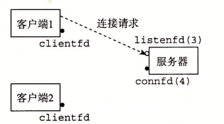
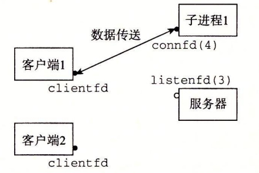
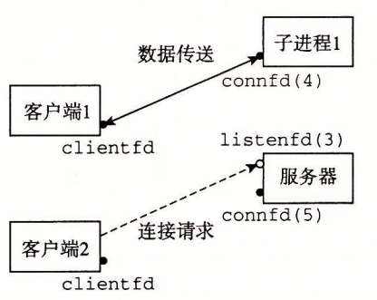
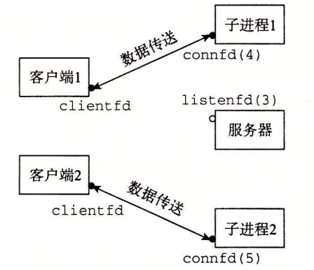

# 12.1 基于进程的并发编程

构造并发程序最简单的方法就是用进程，使用那些大家都很熟悉的函数，像 fork、exec 和 waitpid。例如，一个构造并发服务器的自然方法就是，在父进程中接受客户端连接请求，然后创建一个新的子进程来为每个新客户端提供服务。

为了了解这是如何工作的，假设我们有两个客户端和一个服务器，服务器正在监听一个监听描述符（比如指述符 3）上的连接请求。现在假设服务器接受了客户端 1 的连接请求，并返回一个已连接描述符（比如指述符 4），如图 12-1 所示。在接受连接请求之后，服务器派生一个子进程，这个子进程获得服务器描述符表的完整副本。子进程关闭它的副本中的监听描述符 3，而父进程关闭它的已连接描述符 4 的副本，因为不再需要这些描述符了。



这就得到了图 12-2 中的状态，其中子进程正忙于为客户端提供服务。



因为父、子进程中的已连接描述符都指向同一个文件表表项，所以父进程关闭它的已连接描述符的副本是至关重要的。否则，将永不会释放已连接描述符 4 的文件表条目，而且由此引起的内存泄漏将最终消耗光可用的内存，使系统崩溃。

现在，假设在父进程为客户端 1 创建了子进程之后，它接受一个新的客户端 2 的连接请求，并返回一个新的已连接描述符（比如描述符 5），如图 12-3 所示。



然后，父进程又派生另一个子进程，这个子进程用已连接描述符 5 为它的客户端提供服务，如图 12-4 所示。此时，父进程正在等待下一个连接请求，而两个子进程正在并发地为它们各自的客户端提供服务。



## 12.1.1 基于进程的并发服务器

图 12-5 展示了一个基于进程的并发 echo 服务器的代码。



```c
#include "csapp.h"
void echo(int connfd);

void sigchld_handler(int sig)
{
    while (waitpid(-1, 0, WNOHANG) > 0)
        ;
    return;
}

int main(int argc, char **argv)
{
    int listenfd, connfd;
    socklen_t clientlen;
    struct sockaddr_storage clientaddr;

    if (argc != 2) {
        fprintf(stderr, "usage: %s <port>\n", argv[0]);
        exit(0);
    }

    Signal(SIGCHLD, sigchld_handler);
    listenfd = Open_listenfd(argv[1]);
    while (1) {
        clientlen = sizeof(struct sockaddr_storage);
        connfd = Accept(listenfd, (SA *) &clientaddr, &clientlen);
        if (Fork() == 0) {
            Close(listenfd); /* Child closes its listening socket */
            echo(connfd);    /* Child services client */
            Close(connfd);   /* Child closes connection with client */
            exit(0);         /* Child exits */
        }
        Close(connfd); /* Parent closes connected socket (important!) */
    }
}
```



> 图 12-5 基于进程的并发 echo 服务器。父进程派生一个子进程来处理每个新的连接请求

第 29 行调用的 echo 函数来自于图 11-21。关于这个服务器，有几点重要内容需要说明：

* 首先，通常服务器会运行很长的时间，所以我们必须要包括一个 SIGCHLD 处理程序，来回收僵死（zombie）子进程的资源（第 4~9 行）。因为当 SIGCHLD 处理程序执行时，SIGCHLD 信号是阻塞的，而 Linux 信号是不排队的，所以 SIGCHLD 处理程序必须准备好回收多个僵死子进程的资源。
* 其次，父子进程必须关闭它们各自的 connfd（分别为第 33 行和第 30 行）副本。就像我们已经提到过的，这对父进程而言尤为重要，它必须关闭它的已连接描述符，以避免内存泄漏。
* 最后，因为套接字的文件表表项中的引用计数，直到父子进程的 connfd 都关闭了，到客户端的连接才会终止。

## 12.1.2 进程的优劣

对于在父、子进程间共享状态信息，进程有一个非常清晰的模型：共享文件表，但是不共享用户地址空间。进程有独立的地址空间既是优点也是缺点。这样一来，一个进程不可能不小心覆盖另一个进程的虚拟内存，这就消除了许多令人迷惑的错误一一这是一个明显的优点。

另一方面，独立的地址空间使得进程共享状态信息变得更加困难。为了共享信息，它们必须使用显式的 **IPC**（进程间通信）机制。（参见下面的旁注。）基于进程的设计的另一个缺点是，它们往往比较慢，因为进程控制和 IPC 的开销很高。


### 旁注 - Unix IPC

在本书中，你已经遇到好几个 IPC 的例子了。第 8 章中的 waitpid 函数和信号是基本的 IPC 机制，它们允许进程发送小消息到同一主机上的其他进程。第 11 章的套接字接口是 IPC 的一种重要形式，它允许不同主机上的进程交换任意的字节流。然而，术语 UnixIPC 通常指的是所有允许进程和同一台主机上其他进程进行通信的技术。其中包括管道、先进先出（FIFO）、系统 V 共享内存，以及系统 V 信号量（semaphore）。这些机制超出了我们的讨论范围。Kerrisk 的著作【62】是很好的参考资料。


### 练习题 12.1



在图 12-5 中，并发服务器的第 33 行上，父进程关闭了已连接描述符后，子进程仍然能够使用该描述符和客户端通信。为什么？





当父进程派生子进程时，它得到一个已连接描述符的副本，并将相关文件表中的引用计数从 1 增加到 2。当父进程关闭它的描述符副本时，引用计数就从 2 减少到 1。因为内核不会关闭一个文件，直到文件表中它的引用计数值变为零，所以子进程这边的连接端将保持打开。



### 练习题 12.2



如果我们要删除图 12-5 中关闭已连接描述符的第 30 行，从没有内存泄漏的角度来说，代码将仍然是正确的。为什么？





当一个进程因为某种原因终止时，内核将关闭所有打开的描述符。因此，当子进程退出时，它的已连接文件描述符的副本也将被自动关闭。



